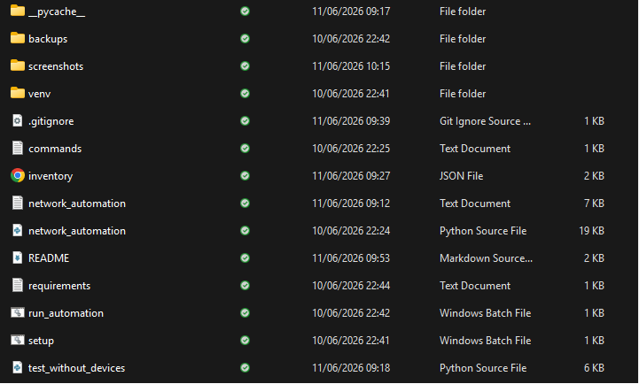

# Cisco Network Automation Tool

## Overview

A production-ready Network Automation Tool built using Python and Netmiko for Cisco IOS devices.

The tool automates:

- Configuration deployment
- Device validation
- Configuration backups
- Error handling
- Logging
- Multi-device concurrent execution

This project demonstrates enterprise-grade network automation concepts used in modern network operations and Cisco environments.

---

## Architecture

```text
Inventory.json
      │
      ▼
Load Device Inventory
      │
      ▼
SSH Connection (Netmiko)
      │
      ▼
Pre-Validation
      │
      ▼
Deploy Configuration
      │
      ▼
Post-Validation
      │
      ▼
Backup Configuration
      │
      ▼
Logging & Reporting
```

---

## Key Outcomes

- Automated Cisco IOS device management using Python.
- Reduced manual configuration effort through reusable command templates.
- Implemented scalable multi-device execution using multithreading.
- Automated configuration validation before and after deployment.
- Enabled automatic running-configuration backups.
- Developed centralized logging and error-handling workflows.
- Improved operational consistency across multiple network devices.

---

## Features

### Device Inventory Management

- JSON-based inventory management
- Multi-device support
- SSH-based connectivity
- Scalable architecture

### Configuration Deployment

- Automated Cisco IOS command execution
- Batch configuration deployment
- Reusable command templates
- Parallel execution support

### Validation System

- Pre-deployment validation
- Post-deployment verification
- Device state checking

### Backup Management

- Automatic running-config backup
- Timestamped backup files
- Local backup storage

### Logging & Monitoring

- Detailed execution logs
- Error reporting
- Real-time status tracking

### Parallel Execution

- ThreadPoolExecutor implementation
- Concurrent device management
- Faster deployment operations

---

## Technologies

- Python
- Netmiko
- Cisco IOS
- Paramiko
- ThreadPoolExecutor
- JSON
- Logging
- NTC Templates

---

## Project Structure

```text
cisco-network-automation-tool/
│
├── network_automation.py
├── inventory.json
├── commands.txt
├── requirements.txt
├── test_without_devices.py
├── README.md
├── screenshots/
│   ├── execution.png
│   ├── logs.png
│
└── backups/
```
---
## Demo

### Execution Output

Demonstration of the automation framework validation and diagnostic mode.


### Logging & Error Handling

Example execution logs showing device processing, connection attempts, and error handling.


### Project Structure

Repository organization and project files.


---

## Installation

Clone the repository:

```bash
git clone https://github.com/SMehta13-19/cisco-network-automation-tool.git
```

Move into the project directory:

```bash
cd cisco-network-automation-tool
```

Install dependencies:

```bash
pip install -r requirements.txt
```

---

## Run

Execute the automation tool:

```bash
python network_automation.py
```

Run validation/testing mode:

```bash
python test_without_devices.py
```

---

## Sample Workflow

1. Load device inventory from JSON file.
2. Establish SSH connection to Cisco devices.
3. Perform pre-deployment validation.
4. Deploy configuration commands.
5. Perform post-deployment verification.
6. Save configuration backups.
7. Generate execution logs and reports.

---

## Future Enhancements

- Flask-based web dashboard
- Configuration rollback support
- Email alerts and notifications
- Cisco DNA Center API integration
- Network topology visualization
- REST API support
- Role-based access control

---

## Skills Demonstrated

- Network Automation
- Cisco IOS Management
- Python Development
- Multithreading
- SSH Automation
- Logging & Monitoring
- Exception Handling
- Infrastructure Automation
- Configuration Management

---

## Author

**Soumya Mehta**

B.Tech Electronics & Communication Engineering

CCNA Certified | Network Automation Enthusiast

GitHub: https://github.com/SMehta13-19
