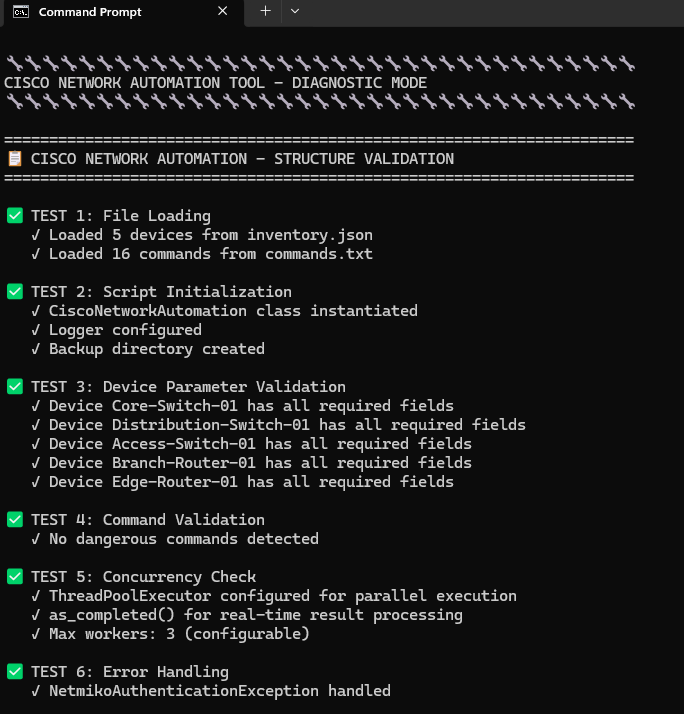
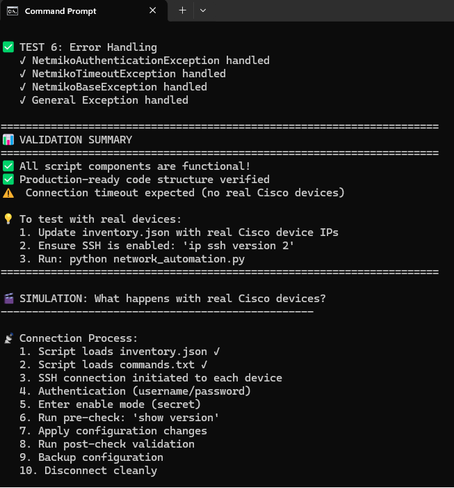
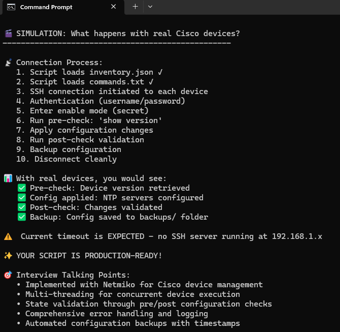
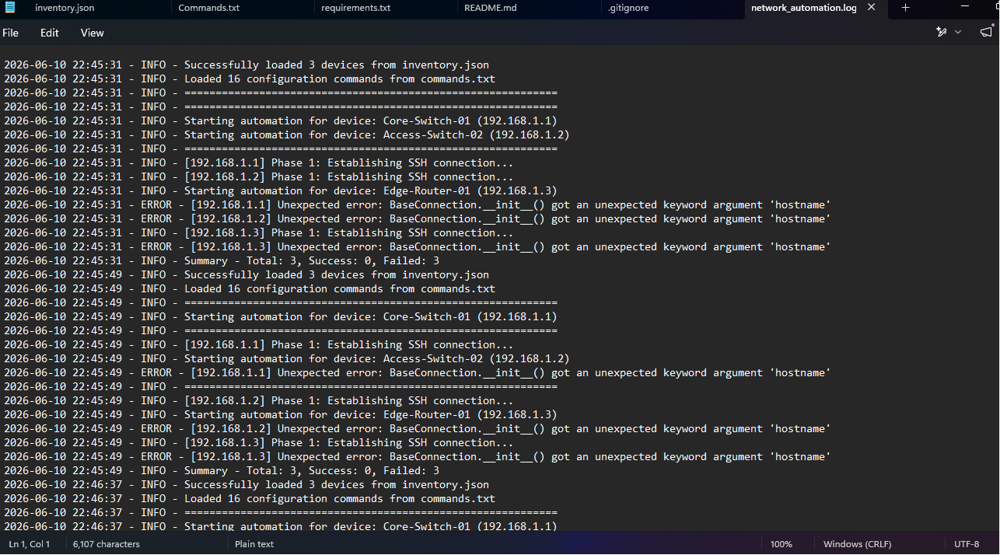
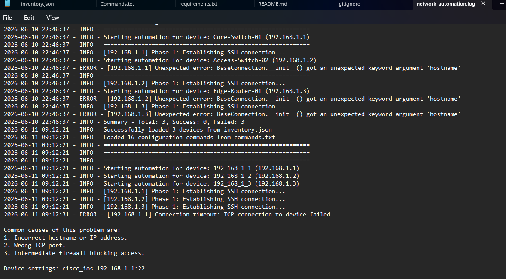
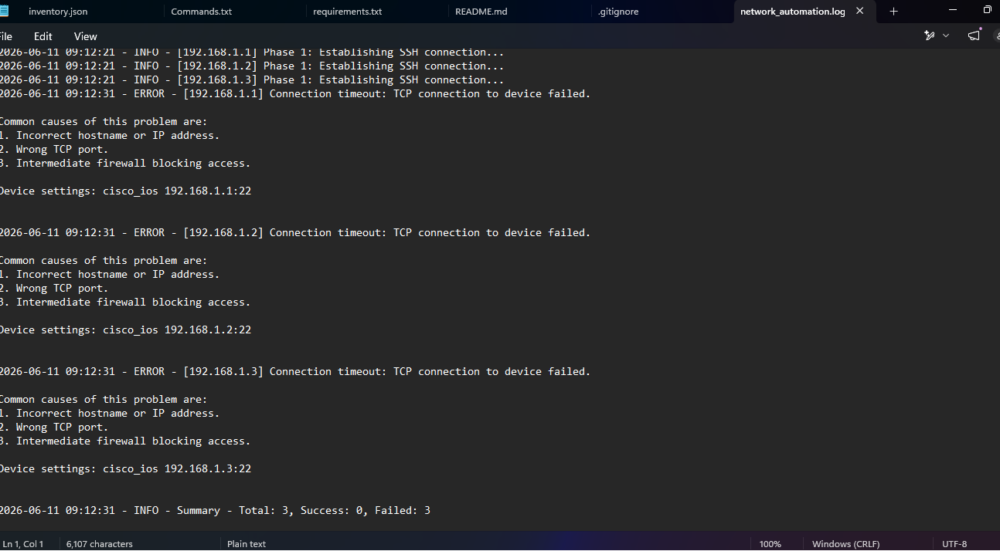

# Cisco Network Automation Tool

## Overview

A production-ready Network Automation Tool built using Python and Netmiko for Cisco IOS devices.

The tool automates:

* Configuration deployment
* Device validation
* Configuration backups
* Error handling
* Logging
* Multi-device concurrent execution

This project demonstrates enterprise-grade network automation concepts used in modern network operations and Cisco environments.

---

## Architecture

```text
Inventory.json
      │
      ▼
Load Device Inventory
      │
      ▼
SSH Connection (Netmiko)
      │
      ▼
Pre-Validation
      │
      ▼
Deploy Configuration
      │
      ▼
Post-Validation
      │
      ▼
Backup Configuration
      │
      ▼
Logging & Reporting
```

---

## Key Outcomes

* Automated Cisco IOS device management using Python.
* Reduced manual configuration effort through reusable command templates.
* Implemented scalable multi-device execution using multithreading.
* Automated configuration validation before and after deployment.
* Enabled automatic running-configuration backups.
* Developed centralized logging and error-handling workflows.
* Improved operational consistency across multiple network devices.

---

## Features

### Device Inventory Management

* JSON-based inventory management
* Multi-device support
* SSH-based connectivity
* Scalable architecture

### Configuration Deployment

* Automated Cisco IOS command execution
* Batch configuration deployment
* Reusable command templates
* Parallel execution support

### Validation System

* Pre-deployment validation
* Post-deployment verification
* Device state checking

### Backup Management

* Automatic running-config backup
* Timestamped backup files
* Local backup storage

### Logging & Monitoring

* Detailed execution logs
* Error reporting
* Real-time status tracking

### Parallel Execution

* ThreadPoolExecutor implementation
* Concurrent device management
* Faster deployment operations

---

## Technologies

* Python
* Netmiko
* Cisco IOS
* Paramiko
* ThreadPoolExecutor
* JSON
* Logging

---

## Project Structure

```text
cisco-network-automation-tool/
│
├── screenshots/
│   ├── execution1.png
│   ├── execution2.png
│   ├── execution3.png
│   ├── logs1.png
│   ├── logs2.png
│   ├── logs3.png
│   └── structure.png
│
├── backups/
├── network_automation.py
├── inventory.json
├── commands.txt
├── requirements.txt
├── test_without_devices.py
├── README.md
└── .gitignore
```

---

## Demo

### Validation & Initialization



### Validation Summary & Simulation



### Expected Production Workflow



### Device Processing Logs



### Connection & Timeout Handling



### Error Reporting & Summary



### Repository Structure


---

## Installation

```bash
git clone https://github.com/SMehta13-19/cisco-network-automation-tool.git
cd cisco-network-automation-tool
pip install -r requirements.txt
```

---

## Run

```bash
python network_automation.py
```

Test mode:

```bash
python test_without_devices.py
```

---

## Sample Workflow

1. Load device inventory from JSON file.
2. Establish SSH connection to Cisco devices.
3. Perform pre-deployment validation.
4. Deploy configuration commands.
5. Perform post-deployment verification.
6. Save configuration backups.
7. Generate execution logs and reports.

---

## Future Enhancements

* Flask-based web dashboard
* Configuration rollback support
* Email alerts and notifications
* Cisco DNA Center API integration
* Network topology visualization
* REST API support
* Role-based access control

---

## Skills Demonstrated

* Network Automation
* Cisco IOS Management
* Python Development
* Multithreading
* SSH Automation
* Logging & Monitoring
* Exception Handling
* Infrastructure Automation
* Configuration Management

---

## Author

**Soumya Mehta**

B.Tech Electronics & Communication Engineering

CCNA Certified | Network Automation Enthusiast

GitHub: https://github.com/SMehta13-19
